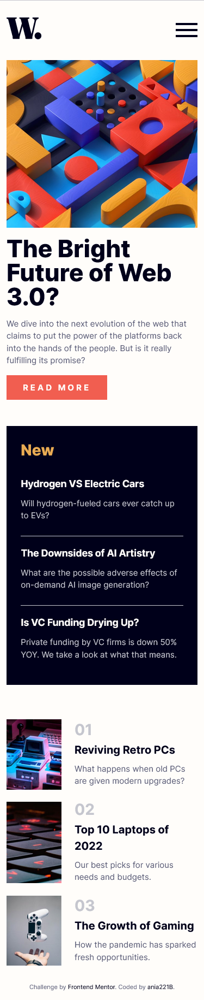
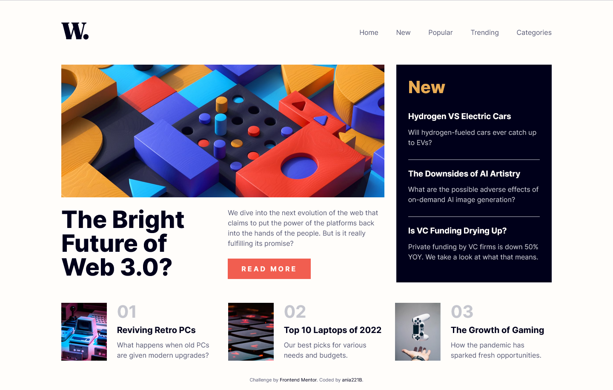

# Frontend Mentor - News homepage solution

This is a solution to the [News homepage challenge on Frontend Mentor](https://www.frontendmentor.io/challenges/news-homepage-H6SWTa1MFl). Frontend Mentor challenges help you improve your coding skills by building realistic projects.

## Table of contents

- [Overview](#overview)
  - [The challenge](#the-challenge)
  - [Screenshot](#screenshot)
  - [Links](#links)
- [My process](#my-process)
  - [Built with](#built-with)
  - [What I learned](#what-i-learned)
  - [Continued development](#continued-development)
  - [Useful resources](#useful-resources)
- [Author](#author)

## Overview

### The challenge

Users should be able to:

- View the optimal layout for the interface depending on their device's screen size
- See hover and focus states for all interactive elements on the page
- **Bonus**: Toggle the mobile menu (requires some JavaScript)

### Screenshot




### Links

- Solution URL: [GitHub](https://github.com/ania221B/news-homepage)
- Live Site URL: [GitHub Pages](https://ania221b.github.io/news-homepage/)

## My process

### Built with

- Semantic HTML5 markup
- CSS custom properties
- Flexbox
- CSS Grid
- Mobile-first workflow

### What I learned

#### Accessible SVG

When you use an inline SVG many assistive technologies won't recognize them. This is why you need to:

- add a `title` tag after the opening `svg` tag and before `path` tag
- have an `id` attribute for the title
- add a `aria-describedby` to `svg` and give it the same value as the `id` for `title` added before
- optionally you can provide a description using a `desc` tag with its own `id` that will also be added to the `aria-descirbedby`
- give `role="img"` to the `svg`

```html
<svg
  width="65"
  height="40"
  xmlns="http://www.w3.org/2000/svg"
  aria-describedby="my-image"
  role="img"
>
  <title id="my-image">Image used on the website</title>
  <path />
</svg>
```

#### Animated hamburger menu

For this project I wanted to make a button that would animate when opening and closing the mobile menu. There were some SVGs provided for the button, yet I didn't know how to animate these. I wanted to prepare my own SVG (link to article below) but it didn't work out. This is why I decided to use good old spans and transitions. It's nothing fancy but it works and it's a decent animation:

```html
<button class="btn mobile-btn" aria-label="mobile navigation menu" aria-controls="primary-nav" aria-expanded="false">
  <span class="line line1">
  <span class="line line2">
  <span class="line line3">
</button>
```

```css
.mobile-btn {
  border: none;
  background: none;
  cursor: pointer;
}

.mobile-btn .line {
  width: 2.5rem;
  height: 0.25rem;
  background-color: hsl(var(--clr-neutral-900));

  transition: transform 500ms ease-in-out, opacity 300ms ease-in-out;
}

.mobile-btn .line:where(:not(:first-of-type)) {
  margin-top: 0.45rem;
}

.mobile-btn[aria-expanded="true"] .line2 {
  transform: translateX(-50%);
  opacity: 0;
}

.mobile-btn[aria-expanded="true"] .line1 {
  transform: translateY(0.65rem) rotate(45deg);
}

.mobile-btn[aria-expanded="true"] .line3 {
  transform: translateY(-0.75rem) rotate(-45deg);
}
```

Apart from that I also used `clip-path` to create a transition effect for article button and skip to content link:

```css
.btn {
  border: none;
  background: none;
  cursor: pointer;

  position: relative;
  z-index: 1;
  isolation: isolate;
}

btn::before {
  content: "";
  position: absolute;
  inset: 0;
  width: 100%;
  background-color: hsl(var(--clr-neutral-900));
  clip-path: circle(0% at 0%, 0%);
  z-index: -1;
}

.btn:hover::before,
.btn:focus::before {
  clip-path: circle(75%);
}
```

I also applied some outline styling for keyboard focus using `focus-visible`:

```css
.mobile-btn:focus-visible {
  outline: none;
  outline: 0.125rem solid hsl(var(--clr-secondary-400));
}
```

### Continued development

- accessibility
- JS
- good page structure
- animated buttons

### Useful resources

- [Accessible SVGs](https://a11y-101.com/development/svg) - This helped me make the SVG accessible
- [Keyboard-Only Focus Styles](https://css-tricks.com/keyboard-only-focus-styles/) - Reminded me about `focus-visible`, so that I could replace blue outlines with different ones only on keyboard focus.

- [Link in Header? Or Header in Link? ](https://css-tricks.com/link-header-header-link/) - Helped me to decide whether to put links inside headers or the other way round.

- [The 🍔 menu](https://uxdesign.cc/the-menu-210bec7ad80c) - I was hoping to learn to animate SVG with the help of this article. Unfortunately, the SVG I made didn't behave as expected. I'm not sure why but maybe I can figure it out in the future.

- [The most common HTML mistake that I see](https://www.youtube.com/watch?v=NexL5_Vdoq8) - This video is why I decided to add some hidden headings and structure my HTML the way I did.

## Author

- Frontend Mentor - [@ania221B](https://www.frontendmentor.io/profile/yourusername)
